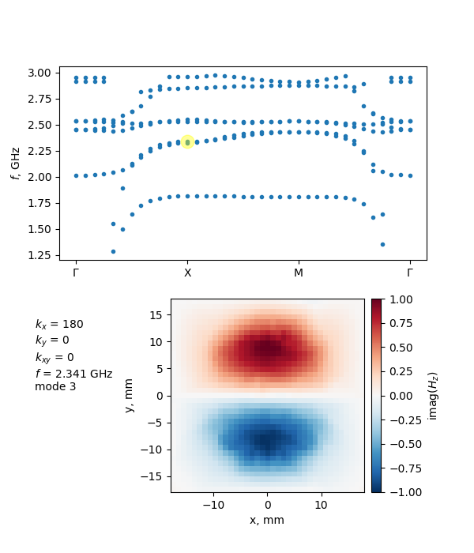

## About

An interactive visualization of a dispersion diagram and eigenmodes profiles of **square lattice unit cell** from numerical simulations in CST Microwave Studio.

You can click on any point in the dispersion plot or use the **n** / **p** keys to navigate through the modes.


## Installation

1. Clone the repository:
   ```bash
   git clone https://github.com/Roz-Alina/cst-dispersion-viewer.git

2. Install packages:
   ```
   pip install -r requirements.txt
   ```
## Numerical simulations in CST Microwave Studio

Step-by-step [tutorial](Unit_cell_dispersion_in_CST_tutorial.pdf) demonstrates the calculation
of a dispersion diagram for square lattice of photonic resonators through
the high-symmetry points of the Brillouin zone  &Gamma;-X-M-&Gamma; and the extraction of electric (E) and magnetic (H) field profiles for the obtained eigenmodes.

## Repository Structure
```
├── README.md                                           # Project overview
├── Unit_cell_dispersion_in_CST_tutorial.pdf            # Tutorial on dispersion calculation in CST
├── dispersion_example.png                              # Tool screenshot
├── dispersion_viewer_utils.py                          # Core functions and the PointBrowser class
├── example.py                                          # Main script to run the visualization
├── requirements.txt                                    # List of required packages
└── unit_cell_data/                                     # Sample data 
```

## Input Data Format

The tool expects text files exported from CST Microwave Studio with the following name:

`*_kx_<kx>_ky_<ky>_kxy_<kxy>_mode_<mode>_f_<freq>.txt`

where:

`kx`, `ky`, `kxy` – phase shifts in degrees (integers)

`mode` – eigenmode number (integer)

`freq` – eigenmode frequency in GHz (float)

The extraction of text files from CST with the required name pattern is described in [tutorial](Unit_cell_dispersion_in_CST_tutorial.pdf).

Each field file is a plain text file with 9 columns (whitespace‑separated):


| Column  | Content |
| ------------- | ------------- |
| 0  | x coordinate  |
| 1  | y coordinate  |
| 2  | z coordinate  |
| 3  | Re(x field component)  |
| 4  | Im(x field component)  |
| 5  | Re(y field component)  |
| 6  | Im(y field component)  |
| 7  | Re(z field component)  |
| 8  | Im(z field component)  |

## Configuration

Open `plot_dispersion.py` and adjust the user settings:

```python
profiles_directory = 'path/to/your/data/folder'
field_label = 'H'            # 'E' or 'H' – used in colorbar labels
component = 'z'              # 'x', 'y' or 'z' – which component to display
option = 'im'                # 'abs' – amplitude, 're' – real part, 'im' – imaginary part
plane = 'xy'                 # 'xy', 'xz' or 'yz' – plane of the field
```


